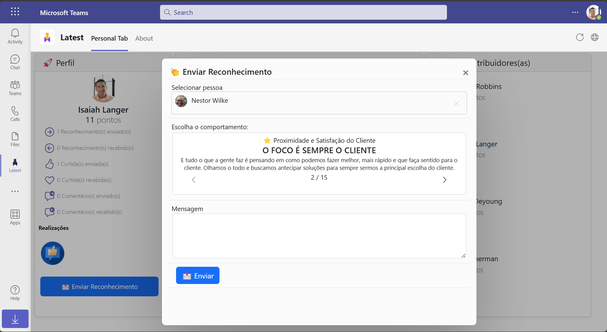

# Kudos

[Deployment guide](https://github.com/luishdemetrio/MyKudosDashboard/wiki)   |
| ----  |

Kudos, also known as *"virtual high-fives"*, are a way for employees to recognize and appreciate each other's efforts in the workplace. They can be a simple and effective way to boost morale, build camaraderie, and acknowledge good work. Kudos allows employees to attach specific examples or achievements to their kudos, and tracking the number of kudos received by each employee to create a leaderboard. Additionally, through the top contributors, you could also include other recognition and reward options, such as bonuses, time off, or special perks for those who consistently receive kudos.

<video src="images/SuperKudos.mp4" width="640" height="480" controls></video>

The Dashboard UI allows users to visualize the "kudos" that were sent to employees, as well as the ability to send "kudos", "likes" and write supportive messages. This type of system is often used in employee recognition and engagement programs to encourage positive behavior and acknowledge the achievements of employees.

The "Send Kudos to people" UI allows users to select an individual to recognize with a "Kudos", choose a category for the recognition, and write a supportive message. The category selection feature allows for more specific recognition and tracking of employee achievements, and the option to include a message allows for personalized and meaningful recognition.

The App sends out notification cards to the employee who received the "Kudos" recognition, as well as to the employee's manager, and the person who sent the recognition. This type of notification ensures that all parties involved are aware of the recognition and its details. It allows the employee to feel acknowledged and appreciated, the manager to be aware of their employees achievements, and the sender to feel good about recognizing the employee. It also allows for transparency and accountability in the recognition process.

Users to comment on the "Kudos" recognition that was received by an employee. This feature allows for further engagement and interaction between users, and allows for a more detailed and specific recognition of the employee's achievements. The ability to comment on a recognition also allows for more context to be added to the recognition, which can help the employee and others understand the impact of their achievements.

## Legal notice

This app template is provided under the [MIT License](https://github.com/OfficeDev/OfficeDev/microsoft-teams-stickers-app/blob/master/LICENSE) terms.  In addition to these terms, by using this app template you agree to the following:

- You, not Microsoft, will license the use of your app to users or organization. 

- This app template is not intended to substitute your own regulatory due diligence or make you or your app compliant with respect to any applicable regulations, including but not limited to privacy, healthcare, employment, or financial regulations.

- You are responsible for complying with all applicable privacy and security regulations including those related to use, collection and handling of any personal data by your app. This includes complying with all internal privacy and security policies of your organization if your app is developed to be sideloaded internally within your organization. Where applicable, you may be responsible for data related incidents or data subject requests for data collected through your app.

- Any trademarks or registered trademarks of Microsoft in the United States and/or other countries and logos included in this repository are the property of Microsoft, and the license for this project does not grant you rights to use any Microsoft names, logos or trademarks outside of this repository. Microsoft’s general trademark guidelines can be found [here](https://www.microsoft.com/en-us/legal/intellectualproperty/trademarks/usage/general.aspx).

- If the app template enables access to any Microsoft Internet-based services (e.g., Office365), use of those services will be subject to the separately-provided terms of use. In such cases, Microsoft may collect telemetry data related to app template usage and operation. Use and handling of telemetry data will be performed in accordance with such terms of use.

- Use of this template does not guarantee acceptance of your app to the Teams app store. To make this app available in the Teams app store, you will have to comply with the [submission and validation process](https://docs.microsoft.com/en-us/microsoftteams/platform/concepts/deploy-and-publish/appsource/publish), and all associated requirements such as including your own privacy statement and terms of use for your app.

## Feedback

Thoughts? Questions? Ideas? Share them with us!

Please report bugs and other code issues [here](https://github.com/luishdemetrio/MyApprovalsHub/issues/new).

## Contributing

This project welcomes contributions and suggestions.  Most contributions require you to agree to a
Contributor License Agreement (CLA) declaring that you have the right to, and actually do, grant us
the rights to use your contribution. For details, visit https://cla.microsoft.com.

When you submit a pull request, a CLA-bot will automatically determine whether you need to provide
a CLA and decorate the PR appropriately (e.g., label, comment). Simply follow the instructions
provided by the bot. You will only need to do this once across all repos using our CLA.

This project has adopted the [Microsoft Open Source Code of Conduct](https://opensource.microsoft.com/codeofconduct/).
For more information see the [Code of Conduct FAQ](https://opensource.microsoft.com/codeofconduct/faq/) or
contact [opencode@microsoft.com](mailto:opencode@microsoft.com) with any additional questions or comments.